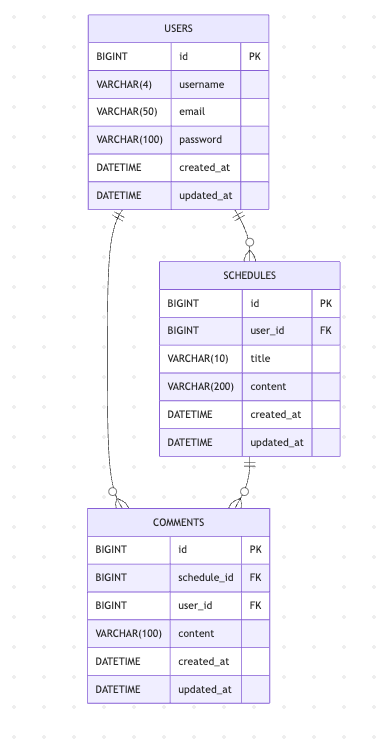

# 일정 관리 앱

Spring Boot, JPA, Cookie/Session 기반으로 구현한 일정 관리 REST API 서버입니다.

## 실행 방법

1. `application.properties.example`을 복사해 `application.properties`로 이름 변경
2. DB 연결 정보 입력
3. MySQL에서 데이터베이스 생성

```sql
CREATE DATABASE schedule_db_v2;
```

4. 애플리케이션 실행

```bash
./gradlew bootRun
```

5. `http://localhost:8080` 접속 확인


### 인증 방식

- 인증 방식은 `Cookie / Session` 입니다.
- 로그인 성공 시 서버가 세션을 생성하고, 클라이언트는 `JSESSIONID` 쿠키를 전달받습니다.
- 인증이 필요한 API는 요청 헤더에 `Cookie: JSESSIONID=...` 값을 포함해야 합니다.

### 공통 Validation 규칙

- 유저명: 필수, 4자 이하
- 이메일: 필수, 이메일 형식
- 비밀번호: 필수, 8자 이상
- 일정 제목: 필수, 10자 이하
- 일정 내용: 필수, 200자 이하
- 댓글 내용: 필수, 100자 이하

### 공통 에러 응답 형식

```json
{
  "status": 400,
  "message": "요청 값이 올바르지 않습니다."
}
```

| 이름 | 데이터타입 | 설명 |
| --- | --- | --- |
| `status` | `int` | HTTP 상태 코드 |
| `message` | `String` | 예외 메시지 |

<details>
  <summary><h2 style="display: inline;">✅ 일정 API 명세</h2></summary>

<br>

<details>
  <summary><h3 style="display: inline;">일정 생성 API</h3></summary>

**URL :** `/schedules`

**Method :** `POST`

**설명**

로그인한 유저가 일정을 생성하는 API 입니다.

**요청 (Request)**

**Request Headers**

| 이름 | 데이터타입 | 설명 |
| --- | --- | --- |
| `Content-Type` | `String` | `application/json` 고정 |
| `Cookie` | `String` | 로그인 후 발급받은 `JSESSIONID` |

**Request Body**

```json
{
  "title": "과제",
  "content": "일정 CRUD 구현"
}
```

| 이름 | 데이터타입 | 필수여부 | 설명 |
| --- | --- | --- | --- |
| `title` | `String` | 필수 | 일정 제목 |
| `content` | `String` | 필수 | 일정 내용 |

**응답 (Response)**

**201 Created :** 일정 생성 성공

```json
{
  "id": 1,
  "userId": 1,
  "username": "jeon",
  "title": "과제",
  "content": "일정 CRUD 구현",
  "createdAt": "2026-04-20T11:20:00",
  "updatedAt": "2026-04-20T11:20:00"
}
```

| 이름 | 데이터타입 | 설명 |
| --- | --- | --- |
| `id` | `Long` | 자동 생성된 일정 고유 ID |
| `userId` | `Long` | 작성한 유저 ID |
| `username` | `String` | 작성한 유저명 |
| `title` | `String` | 일정 제목 |
| `content` | `String` | 일정 내용 |
| `createdAt` | `LocalDateTime` | 생성일 |
| `updatedAt` | `LocalDateTime` | 수정일 |

**실패 응답 예시**

**400 Bad Request**

```json
{
  "status": 400,
  "message": "할일 제목은 10자 이하여야 합니다."
}
```

**401 Unauthorized**

```json
{
  "status": 401,
  "message": "로그인이 필요한 요청입니다."
}
```

</details>

<br>

<details>
  <summary><h3 style="display: inline;">일정 전체 조회 API</h3></summary>

**URL :** `/schedules`

**Method :** `GET`

**설명**

등록된 전체 일정 목록을 조회하는 API 입니다.

**응답 (Response)**

**200 OK :** 조회 성공

```json
[
  {
    "id": 1,
    "userId": 1,
    "username": "jeon",
    "title": "과제",
    "content": "일정 CRUD 구현",
    "createdAt": "2026-04-20T11:20:00",
    "updatedAt": "2026-04-20T11:20:00"
  }
]
```

| 이름 | 데이터타입 | 설명 |
| --- | --- | --- |
| `id` | `Long` | 일정 고유 ID |
| `userId` | `Long` | 작성 유저 ID |
| `username` | `String` | 작성 유저명 |
| `title` | `String` | 일정 제목 |
| `content` | `String` | 일정 내용 |
| `createdAt` | `LocalDateTime` | 생성일 |
| `updatedAt` | `LocalDateTime` | 수정일 |

**실패 응답 예시**

- 없음
- 조회 결과가 없을 경우에도 `200 OK`와 빈 배열 `[]`를 반환합니다.

</details>

<br>

<details>
  <summary><h3 style="display: inline;">일정 단건 조회 API</h3></summary>

**URL :** `/schedules/{scheduleId}`

**Method :** `GET`

**설명**

특정 일정 하나를 ID로 조회하는 API 입니다.

**PathVariable**

| 이름 | 데이터타입 | 설명 |
| --- | --- | --- |
| `scheduleId` | `Long` | 조회할 일정의 고유 ID |

**응답 (Response)**

**200 OK :** 조회 성공

```json
{
  "id": 1,
  "userId": 1,
  "username": "jeon",
  "title": "과제",
  "content": "일정 CRUD 구현",
  "createdAt": "2026-04-20T11:20:00",
  "updatedAt": "2026-04-20T11:20:00"
}
```

**실패 응답 예시**

**404 Not Found**

```json
{
  "status": 404,
  "message": "존재하지 않는 일정입니다."
}
```

</details>

<br>

<details>
  <summary><h3 style="display: inline;">일정 수정 API</h3></summary>

**URL :** `/schedules/{scheduleId}`

**Method :** `PUT`

**설명**

로그인한 유저가 자신의 일정을 수정하는 API 입니다.

**PathVariable**

| 이름 | 데이터타입 | 설명 |
| --- | --- | --- |
| `scheduleId` | `Long` | 수정할 일정의 고유 ID |

**Request Headers**

| 이름 | 데이터타입 | 설명 |
| --- | --- | --- |
| `Content-Type` | `String` | `application/json` 고정 |
| `Cookie` | `String` | 로그인 후 발급받은 `JSESSIONID` |

**Request Body**

```json
{
  "title":    "수정된 제목",
  "content" : "세션 인증 확인 완료"
}
```

| 이름 | 데이터타입 | 필수여부 | 설명 |
| --- | --- | --- | --- |
| `title` | `String` | 필수 | 수정할 일정 제목 |
| `content` | `String` | 필수 | 수정할 일정 내용 |

**응답 (Response)**

**200 OK :** 일정 수정 성공

```json
{
  "id": 1,
  "userId": 1,
  "username": "jeon",
  "title": "수정된 제목",
  "content": "세션 인증 확인 완료",
  "createdAt": "2026-04-20T11:20:00",
  "updatedAt": "2026-04-20T11:25:00"
}
```

**실패 응답 예시**

**400 Bad Request**

```json
{
  "status": 400,
  "message": "할일 내용은 200자 이하여야 합니다."
}
```

**401 Unauthorized**

```json
{
  "status": 401,
  "message": "로그인이 필요한 요청입니다."
}
```

**403 Forbidden**

```json
{
  "status": 403,
  "message": "본인이 작성한 일정만 수정 또는 삭제할 수 있습니다."
}
```

**404 Not Found**

```json
{
  "status": 404,
  "message": "존재하지 않는 일정입니다."
}
```

</details>

<br>

<details>
  <summary><h3 style="display: inline;">일정 삭제 API</h3></summary>

**URL :** `/schedules/{scheduleId}`

**Method :** `DELETE`

**설명**

로그인한 유저가 자신의 일정 하나를 삭제하는 API 입니다.

**PathVariable**

| 이름 | 데이터타입 | 설명 |
| --- | --- | --- |
| `scheduleId` | `Long` | 삭제할 일정의 고유 ID |

**Request Headers**

| 이름 | 데이터타입 | 설명 |
| --- | --- | --- |
| `Cookie` | `String` | 로그인 후 발급받은 `JSESSIONID` |

**응답 (Response)**

**204 No Content :** 삭제 성공

**실패 응답 예시**

**401 Unauthorized**

```json
{
  "status": 401,
  "message": "로그인이 필요한 요청입니다."
}
```

**403 Forbidden**

```json
{
  "status": 403,
  "message": "본인이 작성한 일정만 수정 또는 삭제할 수 있습니다."
}
```

**404 Not Found**

```json
{
  "status": 404,
  "message": "존재하지 않는 일정입니다."
}
```

</details>

</details>

<br>

<details>
  <summary><h2 style="display: inline;">✅ 댓글 API 명세</h2></summary>

<br>

<details>
  <summary><h3 style="display: inline;">댓글 생성 API</h3></summary>

**URL :** `/schedules/{scheduleId}/comments`

**Method :** `POST`

**설명**

로그인한 유저가 특정 일정에 댓글을 작성하는 API 입니다.

**PathVariable**

| 이름 | 데이터타입 | 설명 |
| --- | --- | --- |
| `scheduleId` | `Long` | 댓글을 작성할 일정 ID |

**Request Headers**

| 이름 | 데이터타입 | 설명 |
| --- | --- | --- |
| `Content-Type` | `String` | `application/json` 고정 |
| `Cookie` | `String` | 로그인 후 발급받은 `JSESSIONID` |

**Request Body**

```json
{
  "content": "댓글 작성"
}
```

| 이름 | 데이터타입 | 필수여부 | 설명 |
| --- | --- | --- | --- |
| `content` | `String` | 필수 | 댓글 내용 |

**응답 (Response)**

**201 Created :** 댓글 생성 성공

```json
{
  "id": 1,
  "scheduleId": 1,
  "userId": 1,
  "username": "jeon",
  "content": "댓글 작성",
  "createdAt": "2026-04-20T11:20:00",
  "updatedAt": "2026-04-20T11:20:00"
}
```

**실패 응답 예시**

**400 Bad Request**

```json
{
  "status": 400,
  "message": "댓글 내용은 100자 이하여야 합니다."
}
```

**401 Unauthorized**

```json
{
  "status": 401,
  "message": "로그인이 필요한 요청입니다."
}
```

**404 Not Found**

```json
{
  "status": 404,
  "message": "존재하지 않는 일정입니다."
}
```

</details>

<br>

<details>
  <summary><h3 style="display: inline;">댓글 전체 조회 API</h3></summary>

**URL :** `/schedules/{scheduleId}/comments`

**Method :** `GET`

**설명**

특정 일정의 댓글 목록을 전체 조회하는 API 입니다.

**PathVariable**

| 이름 | 데이터타입 | 설명 |
| --- | --- | --- |
| `scheduleId` | `Long` | 댓글을 조회할 일정 ID |

**응답 (Response)**

**200 OK :** 댓글 조회 성공

```json
[
  {
    "id": 1,
    "scheduleId": 1,
    "userId": 1,
    "username": "jeon",
    "content": "좋은 일정이네요.",
    "createdAt": "2026-04-20T11:30:00",
    "updatedAt": "2026-04-20T11:30:00"
  }
]
```

**실패 응답 예시**

**404 Not Found**

```json
{
  "status": 404,
  "message": "존재하지 않는 일정입니다."
}
```

</details>

</details>

<br>

<details>
  <summary><h2 style="display: inline;">✅ 유저 API 명세</h2></summary>

<br>

<details>
  <summary><h3 style="display: inline;">유저 생성 API</h3></summary>

**URL :** `/users`

**Method :** `POST`

**설명**

유저가 회원가입을 하는 API 입니다.

**Request Headers**

| 이름 | 데이터타입 | 설명 |
| --- | --- | --- |
| `Content-Type` | `String` | `application/json` 고정 |

**Request Body**

```json
{
  "username": "jeon",
  "email": "jeon@test.com",
  "password": "12341234"
}
```

| 이름 | 데이터타입 | 필수여부 | 설명 |
| --- | --- | --- | --- |
| `username` | `String` | 필수 | 유저 이름 |
| `email` | `String` | 필수 | 유저 이메일 |
| `password` | `String` | 필수 | 유저 비밀번호 |

**응답 (Response)**

**201 Created :** 유저 회원가입 성공

```json
{
  "id": 1,
  "username": "jeon",
  "email": "jeon@test.com",
  "createdAt": "2026-04-20T11:30:00",
  "updatedAt": "2026-04-20T11:30:00"
}
```

**실패 응답 예시**

**400 Bad Request**

```json
{
  "status": 400,
  "message": "비밀번호는 8자 이상이어야 합니다."
}
```

**409 Conflict**

```json
{
  "status": 409,
  "message": "이미 사용 중인 이메일입니다."
}
```

</details>

<br>

<details>
  <summary><h3 style="display: inline;">유저 전체 조회 API</h3></summary>

**URL :** `/users`

**Method :** `GET`

**설명**

전체 유저 목록을 조회하는 API 입니다.

**응답 (Response)**

**200 OK :** 유저 전체 조회 성공

```json
[
  {
    "id": 1,
    "username": "jeon",
    "email": "jeon@test.com",
    "createdAt": "2026-04-20T11:30:00",
    "updatedAt": "2026-04-20T11:30:00"
  }
]
```

**실패 응답 예시**

- 없음
- 조회 결과가 없을 경우에도 `200 OK`와 빈 배열 `[]`를 반환합니다.

</details>

<br>

<details>
  <summary><h3 style="display: inline;">유저 단건 조회 API</h3></summary>

**URL :** `/users/{userId}`

**Method :** `GET`

**설명**

특정 유저 1명을 조회하는 API 입니다.

**PathVariable**

| 이름 | 데이터타입 | 설명 |
| --- | --- | --- |
| `userId` | `Long` | 조회할 유저 ID |

**응답 (Response)**

**200 OK :** 유저 단건 조회 성공

```json
{
  "id": 1,
  "username": "jeon",
  "email": "jeon@test.com",
  "createdAt": "2026-04-20T11:30:00",
  "updatedAt": "2026-04-20T11:30:00"
}
```

**실패 응답 예시**

**404 Not Found**

```json
{
  "status": 404,
  "message": "존재하지 않는 유저입니다."
}
```

</details>

<br>

<details>
  <summary><h3 style="display: inline;">유저 수정 API</h3></summary>

**URL :** `/users/{userId}`

**Method :** `PUT`

**설명**

로그인한 유저가 자신의 정보를 수정하는 API 입니다.

**PathVariable**

| 이름 | 데이터타입 | 설명 |
| --- | --- | --- |
| `userId` | `Long` | 수정할 유저 ID |

**Request Headers**

| 이름 | 데이터타입 | 설명 |
| --- | --- | --- |
| `Content-Type` | `String` | `application/json` |
| `Cookie` | `String` | 로그인 후 발급받은 `JSESSIONID` |

**Request Body**

```json
{
  "username": "kim",
  "email": "kim@test.com"
}
```

**응답 (Response)**

**200 OK :** 유저 수정 성공

```json
{
  "id": 1,
  "username": "kim",
  "email": "kim@test.com",
  "createdAt": "2026-04-20T11:30:00",
  "updatedAt": "2026-04-20T35:00:00"
}
```

**실패 응답 예시**

**400 Bad Request**

```json
{
  "status": 400,
  "message": "유저명은 4자 이하여야 합니다."
}
```

**401 Unauthorized**

```json
{
  "status": 401,
  "message": "로그인이 필요한 요청입니다."
}
```

**403 Forbidden**

```json
{
  "status": 403,
  "message": "본인 계정만 수정 또는 삭제할 수 있습니다."
}
```

**409 Conflict**

```json
{
  "status": 409,
  "message": "이미 사용 중인 이메일입니다."
}
```

</details>

<br>

<details>
  <summary><h3 style="display: inline;">유저 삭제 API</h3></summary>

**URL :** `/users/{userId}`

**Method :** `DELETE`

**설명**

로그인한 유저가 자신의 정보를 삭제하는 API 입니다.

**PathVariable**

| 이름 | 데이터타입 | 설명 |
| --- | --- | --- |
| `userId` | `Long` | 삭제할 유저 ID |

**Request Headers**

| 이름 | 데이터타입 | 설명 |
| --- | --- | --- |
| `Cookie` | `String` | 로그인 후 발급받은 `JSESSIONID` |

**응답 (Response)**

**204 No Content :** 유저 삭제 성공

**실패 응답 예시**

**401 Unauthorized**

```json
{
  "status": 401,
  "message": "로그인이 필요한 요청입니다."
}
```

**403 Forbidden**

```json
{
  "status": 403,
  "message": "본인 계정만 수정 또는 삭제할 수 있습니다."
}
```

</details>

</details>

<br>

<details>
  <summary><h2 style="display: inline;">✅ 로그인 관련 API 명세</h2></summary>

<br>

<details>
  <summary><h3 style="display: inline;">로그인 API</h3></summary>

**URL :** `/login`

**Method :** `POST`

**설명**

유저가 이메일과 비밀번호로 로그인하는 API 입니다.

**Request Headers**

| 이름 | 데이터타입 | 설명 |
| --- | --- | --- |
| `Content-Type` | `String` | `application/json` 고정 |

**Request Body**

```json
{
  "email": "jeon@test.com",
  "password": "12341234"
}
```

**응답 (Response)**

**200 OK :** 로그인 성공

```json
{
  "userId": 1,
  "username": "jeon",
  "email": "jeon@test.com",
  "message": "로그인에 성공했습니다."
}
```

**실패 응답 예시**

**400 Bad Request**

```json
{
  "status": 400,
  "message": "올바른 이메일 형식이어야 합니다."
}
```

**401 Unauthorized**

```json
{
  "status": 401,
  "message": "이메일 또는 비밀번호가 올바르지 않습니다."
}
```

</details>

<br>

<details>
  <summary><h3 style="display: inline;">로그아웃 API</h3></summary>

**URL :** `/logout`

**Method :** `DELETE`

**설명**

로그인한 유저가 로그아웃하는 API 입니다.

**Request Headers**

| 이름 | 데이터타입 | 설명 |
| --- | --- | --- |
| `Cookie` | `String` | 로그인 후 발급받은 `JSESSIONID` |

**응답 (Response)**

**204 No Content :** 로그아웃 성공

**실패 응답 예시**

**401 Unauthorized**

```json
{
  "status": 401,
  "message": "로그인이 필요한 요청입니다."
}
```

</details>

</details>

<br>

### 요청 본문(JSON)이 잘못된 경우

```json
{
  "status": 400,
  "message": "요청 본문을 읽을 수 없습니다."
}
```

### 파라미터 타입이 잘못된 경우

```json
{
  "status": 400,
  "message": "요청 파라미터 타입이 올바르지 않습니다."
}
```

### 로그인 없이 보호된 API에 접근한 경우

```json
{
  "status": 401,
  "message": "로그인이 필요한 요청입니다."
}
```

### 권한이 없는 경우

```json
{
  "status": 403,
  "message": "본인 계정만 수정 또는 삭제할 수 있습니다."
}
```

또는

```json
{
  "status": 403,
  "message": "본인이 작성한 일정만 수정 또는 삭제할 수 있습니다."
}
```

### 존재하지 않는 리소스를 요청한 경우

```json
{
  "status": 404,
  "message": "존재하지 않는 일정입니다."
}
```

### 중복 데이터인 경우

```json
{
  "status": 409,
  "message": "이미 사용 중인 이메일입니다."
}
```

## ERD


[//]: # (## 프로젝트 구조)


